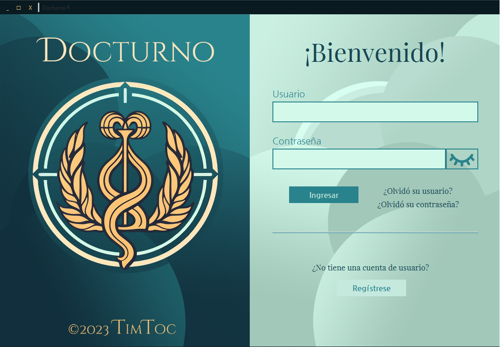
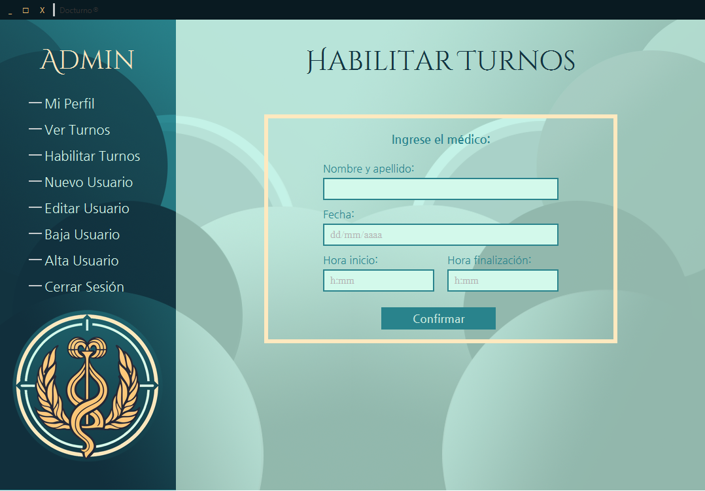

# Proyecto Clínica Médica

Este proyecto de clínica médica es una aplicación de escritorio desarrollada en JavaFX que permite a los pacientes sacar turnos, a los doctores ver sus turnos y a los administrativos gestionar usuarios.

## Integrantes del proyecto

- 
- 
- 
- 

## Estructura del proyecto

El proyecto sigue una estructura de arquitectura de software basada en el patrón Modelo-Vista-Controlador (MVC) en capas para una mejor organización y mantenibilidad del código.

La estructura de carpetas del proyecto es la siguiente:

## Características principales

- Autenticación de usuarios: Los usuarios pueden iniciar sesión en la aplicación con sus credenciales.

- Gestión de permisos: Se implementa un sistema de permisos que permite a los administrativos tener privilegios para agregar, editar y dar de baja usuarios.

- Registro de turnos: Los pacientes pueden registrar turnos y los doctores pueden ver sus turnos asignados.

- Almacenamiento de datos: Los datos de la aplicación se guardan en archivos JSON para una fácil persistencia y portabilidad.

## Dependencias

- 
- 

## Capturas de pantalla

### Pantalla de Login

*Esta captura de pantalla muestra la pantalla de inicio de sesión de nuestra aplicación de Clínica Médica. Los usuarios deben ingresar su nombre de usuario y contraseña para acceder a las funcionalidades del sistema.*

### Pantalla de Administración

*En esta captura de pantalla se muestra la pantalla de administración, diseñada específicamente para los usuarios con permisos de administrador. Aquí se pueden gestionar usuarios, ver turnos, y realizar otras tareas relacionadas con la administración del sistema.*

## Configuración del proyecto

1. Clona el repositorio del proyecto: `git clone https://github.com/tu-usuario/proyecto-clinica-medica.git`
2. Abre el proyecto en tu entorno de desarrollo preferido, como .
3. Configura las dependencias necesarias en el archivo `pom.xml` o `build.gradle`, según el sistema de construcción que utilices.
4. Ejecuta la clase `com.example.clinicamedica.App` para iniciar la aplicación.

## Contribuciones

Este proyecto es un trabajo colaborativo realizado por los integrantes mencionados anteriormente. Si deseas contribuir, por favor sigue estos pasos:

1. Crea un fork del proyecto en tu cuenta de GitHub.
2. Realiza tus cambios y mejoras en una rama separada.
3. Envía una solicitud de extracción (pull request) para revisar tus cambios.

Agradecemos cualquier contribución para mejorar este proyecto.

## Licencia

Este proyecto se encuentra bajo la licencia MIT. Para más información, consulta el archivo [LICENSE](LICENSE).

